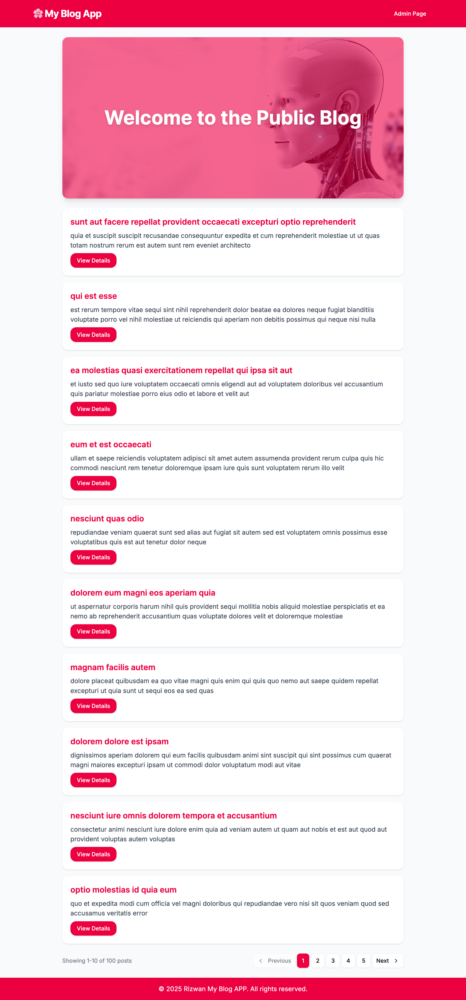

# Blog Dashboard App | Next.js Blog CMS + Public Blog UI

A modern, responsive blog platform built with **Next.js App Router**, featuring a **public blog** and an **admin dashboard** with post creation, editing, deletion, and pagination. The app uses a clean UI powered by **Tailwind CSS**, with enhanced UX elements like tooltips, icons, and responsive design.

---

## Live Demo

[Click here to view the live demo](https://blog-dashboard-app.vercel.app/)




---

## Features

### Public Blog
- View blog posts with titles and excerpts
- Responsive card design
- Link to full post details
- Optimized image loading with `next/image`

### Admin Dashboard
- Create, edit, delete posts
- Rich text editor support
- Pagination for easy navigation
- Reusable UI components
- Edit/Delete buttons with tooltips & icons
- Responsive layout, mobile-friendly

---


### Steps to Install and Run the Project

1. Clone the repository:
git clone ttps://github.com/rizwanbinnawaz/blog-dashboard-app.git
cd blog-dashboard-app

2. Install dependencies:
```bash
npm install
```

3. Run project:
```bash
npm run dev
```

4. build project:
```bash
npm run build
```

Open [http://localhost:3000](http://localhost:3000) with your browser to see the result.


---

## Tech Stack

- **Next.js 15+ (App Router)**
- **React Hook Form**
- **React Query (TanStack Query)**
- **Tailwind CSS**
- **Lucide Icons**
- **TypeScript**

---


## API Source
```bash
https://jsonplaceholder.typicode.com/posts
```


### Author Details:

**Muhammad Rizwan** 

Email: rizwanbinnawaz@gmail.com

Phone: +971525571270

Senior Developer | React | Next.js  

Based in Dubai
